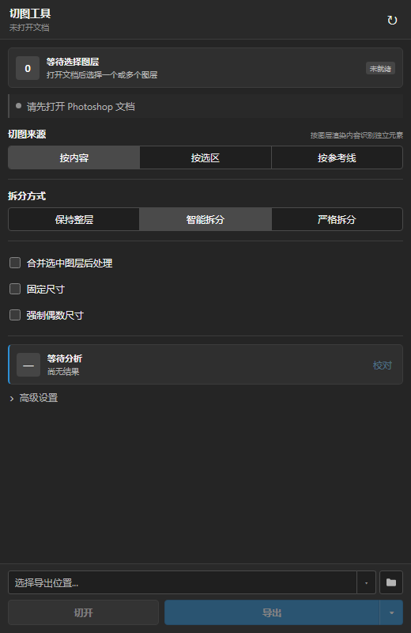
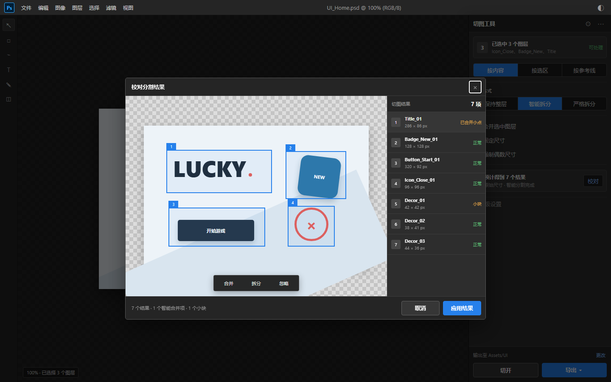

# PS 切图工具

一个面向游戏 UI 美术的 Photoshop 切图插件。它可以把图层中互不连接的内容拆开、校对、打组并导出 PNG，同时支持选区、参考线、固定尺寸和偶数尺寸输出。

> 当前版本：`v1.0.13` | 最低 Photoshop 版本：`24.4` | 已验证环境：Windows 11、Photoshop 27.8.0

## 下载

前往 [Releases](https://github.com/Homer79980/ps-slicer-releases/releases/latest)，在 `Assets` 中下载：

`com.tu.ps-slicer_PS.ccx`

不要下载 GitHub 自动生成的 `Source code` 压缩包；公开仓库不包含插件源码。

## 安装

1. 先关闭正在进行的 Photoshop 模态操作，例如保存、导出或滤镜窗口。
2. 双击下载的 `com.tu.ps-slicer_PS.ccx`。
3. 在 Creative Cloud/Unified Plugin Installer 中确认安装。
4. 安装完成后重启 Photoshop。
5. 打开 `增效工具 > 切图工具`。

升级时直接安装新版 CCX，然后重启 Photoshop 即可。

## 主界面



导出位置位于面板底部：

- 点击路径框或文件夹按钮：选择导出目录。
- 点击路径框中的箭头：选择其他位置、打开文件夹或复制路径。
- 路径过长时会省略显示，导出前后都保留完整路径。

## 快速使用

1. 在 Photoshop 中打开 RGB 8 位或 16 位文档。
2. 选中一个图层，或按住 `Shift` 选择多个图层。
3. 选择切图来源与拆分方式。
4. 按需开启合并图层、固定尺寸或偶数尺寸。
5. 点击`分析`。
6. 有歧义时点击`校对`，确认后应用结果。
7. 选择导出位置，点击`导出`；右侧箭头还可选择`仅导出`或`切开并导出`。

## 切图来源

| 来源 | 适用场景 | 行为 |
|---|---|---|
| 按内容 | 图标、文字、散落元素 | 根据实际 Alpha 内容识别独立元素。 |
| 按选区 | 只输出指定区域 | 以当前选区为输出边界，超出选区的内容会被裁剪。 |
| 按参考线 | 长图、图集、九宫格素材 | 按水平和垂直参考线生成切片网格。 |

## 拆分方式

| 方式 | 行为 |
|---|---|
| 保持整层 | 不拆开图层中的独立内容，只处理整个图层。 |
| 智能拆分 | 自动判断小点与主体的关系，例如文字笔画后的点；有歧义时进入校对。 |
| 严格拆分 | 每个互不连接的 Alpha 区域都作为独立结果。 |

## 多图层处理

- 不勾选`合并选中图层后处理`：每个选中图层分别分析和导出。
- 勾选后：所有选中图层先合并渲染，再按同一规则分析和导出。

## 固定尺寸

- 目标尺寸大于内容：保留透明边缘，并按九宫格锚点放置内容。
- 目标尺寸小于内容：内容等比缩小，不拉伸。
- 开启`强制偶数尺寸`：奇数宽高会在右侧或底部补 1 个透明像素。

## 校对窗口



校对窗口支持：

- 合并多个结果。
- 再次拆分结果。
- 忽略不需要的碎片。
- 修改导出名称。

只有点击`应用结果`后，校对调整才会用于切开或导出。

## 切开与导出

- `切开`：在当前 Photoshop 文档中创建新的像素图层组，不导出文件。
- `仅导出`：导出 PNG，不修改文档图层结构。
- `切开并导出`：同时执行以上两项。

源图层不会被修改。一次切开会合并为一个 Photoshop 历史步骤。

## 导出文件

- PNG 文件按稳定名称输出。
- 重名文件可选择自动改名、跳过或覆盖。
- 可生成 JSON 清单，记录结果尺寸、来源和最终文件哈希。

## 常见问题

### 安装后找不到插件

确认安装器显示成功，然后彻底退出并重新启动 Photoshop。插件入口位于 `增效工具 > 切图工具`，不在传统 CEP 的“窗口 > 扩展”菜单中。

### 面板提示没有可处理图层

先打开受支持的 RGB 文档，并在图层面板中选中至少一个图层。隐藏图层、空图层或缺少选区时，面板会给出对应提示。

### 无法使用选区切图

先使用 Photoshop 矩形选框等工具建立选区，再切换到`按选区`。

### 导出按钮不可用

需要先完成分析；如果结果包含警告或智能拆分歧义，还需要在校对窗口中确认。

## 文件校验

`v1.0.13` 安装包 SHA-256：

```text
D855DA1B4EC6C3C0D585772A114EE9D8FE05E0E1C0B698F8AF0C4673B593FA31
```

## 问题反馈

请在本仓库的 [Issues](https://github.com/Homer79980/ps-slicer-releases/issues) 中提交，并附上 Photoshop 版本、文档模式、操作步骤和错误截图。不要上传含保密素材的 PSD/PSB。

## 使用授权

安装包可免费下载安装使用，也可以分享本仓库的官方 Release 链接。源码未公开；未经许可，不得修改、二次打包、重新上传安装包或冒用作者身份发布。详见 [TERMS.md](TERMS.md)。
