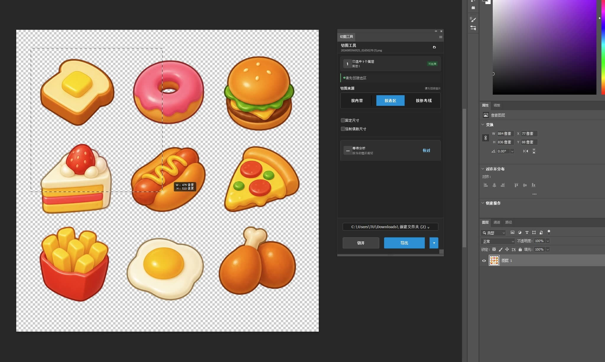
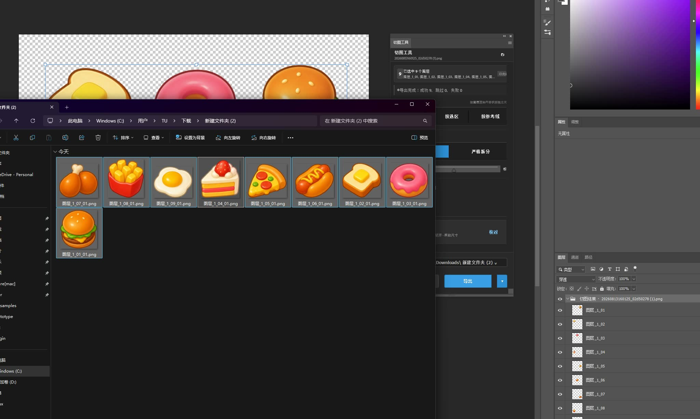

# PS 切图工具

面向游戏 UI 美术的 Photoshop UXP 切图工具。选中图层、选择拆分方式、分析并导出，适合图标、文字、长图和九宫格素材。

> 当前版本：**v1.0.30**  |  最低 Photoshop：**24.4**  |  实机验证：**Windows 11 + Photoshop 27.8.0**

## 下载与仓库说明

### 普通用户：下载 CCX 安装包

前往 [v1.0.30 Release](https://github.com/Homer79980/ps-slicer-releases/releases/tag/v1.0.30)，在 **Assets** 中下载：

`com.tu.ps-slicer_PS.ccx`

也可以直接下载：[com.tu.ps-slicer_PS.ccx](https://github.com/Homer79980/ps-slicer-releases/releases/download/v1.0.30/com.tu.ps-slicer_PS.ccx)

请不要下载 GitHub 自动生成的 `Source code` 压缩包。公开仓库不包含插件源码；CCX 只通过 Release 资产分发。

## 安装说明

1. 关闭 Photoshop 中正在进行的保存、导出、滤镜等模态操作。
2. 下载上面的 `com.tu.ps-slicer_PS.ccx`。
3. 双击 CCX，在 Creative Cloud Desktop / Unified Plugin Installer 中确认第三方插件安装。
4. 安装完成后重启 Photoshop。
5. 在 Photoshop 菜单打开 **增效工具 > 切图工具**。

v1.0.30 使用插件内生成的透明 PNG 缩略图，避免把 Windows/macOS 宿主临时路径交给预览图片；同时把主面板的“分析”和“校对”合并为一次点击的“分析校对”。当透明 PNG 编码不可用时，仍保留 Photoshop ImageBlob 与宿主路径兼容回退。

升级时直接安装更高版本 CCX 并重启 Photoshop。终端用户不需要 Node.js、UXP CLI 或其它开发工具。

插件不依赖本机固定路径、网络请求或私有凭据。当前已验证 Windows 11 + Photoshop 27.8.0；其它符合最低版本的环境建议先用副本文件试运行。

## 主界面

面板底部的导出区域采用紧凑的“路径选择器 + 文件夹按钮”布局：选择目录后点击 **切开**、**导出**，或使用右侧菜单执行“切开并导出”。

## 快速使用

1. 打开 RGB 8 位或 16 位 Photoshop 文档。
2. 选中一个图层、多个图层，或直接选中一个图层组。
3. 选择切图来源：按内容、按选区或按参考线。
4. 选择智能拆分或严格拆分；智能拆分可调节智能强度。
5. 按需开启固定尺寸、强制偶数尺寸，或勾选“合并选中图层后处理”。
6. 点击 **分析校对**，插件完成分析后直接打开校对窗口；直接点击 **切开** 或 **导出** 也会自动完成同一份分析。
7. 选择导出目录，点击 **导出**；需要同时在 PSD 中建立结果组时，选择 **切开并导出**。

## 功能说明

### 拆分方式

| 方式 | 适用场景 |
| --- | --- |
| 智能拆分 | 自动关联视觉上属于同一元素的内容，例如文字和紧邻的小点；可用智能强度控制拆分倾向。 |
| 严格拆分 | 每个互不连接的 Alpha 区域都作为独立结果，适合需要彻底拆开的素材。 |

### 切图来源

| 来源 | 行为 |
| --- | --- |
| 按内容 | 按实际 Alpha 内容识别独立元素。 |
| 按选区 | 以当前选区为边界，选区外内容会被裁剪。 |
| 按参考线 | 按水平、垂直参考线生成切片网格，适合长图和九宫格素材。 |

### 图层与图层组

- 单图层和 Shift 多选图层都可以处理。
- 选中图层组时，工具会递归处理组内可见的末级图层，并保留组内路径；隐藏末级图层不会被意外导出。
- 默认每个视觉结果输出一个 PNG。
- 勾选 **合并选中图层后处理** 时，选中的图层先合并渲染，再按同一规则拆分；适合多个图层共同组成一张素材的情况。
- 组内剪贴蒙版会按一个视觉单元处理，避免基底和剪贴层重复导出。

### 固定尺寸与偶数尺寸

- 目标尺寸大于内容：保留透明边缘并居中输出。
- 目标尺寸小于内容：按比例缩小，不拉伸。
- 开启 **强制偶数尺寸**：奇数宽高自动补 1 个透明像素，方便引擎和图集使用。

### 导出文件

导出目录默认只生成 PNG 文件，不额外生成 JSON 清单。CCX 包内的 `manifest.json` 是 Adobe UXP 安装所必需的插件元数据，不会出现在你的素材导出目录中。

## 校对窗口

校对窗口会显示真实的分割缩略图，而不是空白占位框。点击缩略图可选择结果，使用 **合并**、**拆分**、**忽略** 直接调整当前分析结果；Alpha 阈值和智能强度可重新分析。

## 录屏演示

以下视频来自本次 Photoshop 实机操作录屏，统一使用 9 个食物图标素材，展示从选层、分析、校对到导出的完整工作流。

**视频已上传到公开仓库：[打开 `docs/videos` 视频目录](docs/videos/)。**

需要直接播放时，打开[视频播放页](https://homer79980.github.io/ps-slicer-releases/)。

GitHub 的普通仓库文件页不会为这类较大的 MP4 自动显示播放器，打开某段视频后点击 **View raw** 或 **Download raw** 即可播放/下载。Release 页面只放 CCX 安装包，这是为了让下载入口保持干净。

| 演示 | 内容 |
| --- | --- |
| [01 内容拆分与导出](docs/videos/01-content-split-export.mp4) | 按内容分析独立元素，并查看导出结果。 |
| [02 校对窗口](docs/videos/02-review-window.mp4) | 打开校对分割结果窗口，查看缩略图和结果操作。 |
| [03 拆分策略](docs/videos/03-split-strategy.mp4) | 切换智能/严格拆分并重新分析。 |
| [04 结果预览](docs/videos/04-result-preview.mp4) | 在预览网格中查看多个分割结果。 |
| [05 导出目录](docs/videos/05-export-folder.mp4) | 选择输出位置并查看生成的 PNG 文件。 |
| [06 输出参数](docs/videos/06-output-options.mp4) | 演示输出参数和处理流程。 |
| [07 切开操作](docs/videos/07-cut-operation.mp4) | 只执行切开，在 PSD 中建立结果。 |
| [08 多图层处理](docs/videos/08-multi-layer-processing.mp4) | 多图层选择与合并处理流程。 |
| [09 PNG 导出结果](docs/videos/09-png-results.mp4) | 在输出文件夹中查看拆分后的 PNG。 |
| [10 单图层切图](docs/videos/10-single-layer-slice.mp4) | 单个图层的切图操作。 |
| [11 完整回放](docs/videos/11-full-workflow.mp4) | 从准备素材到完成导出的完整演示。 |

## 常见问题

### 为什么导出目录没有 JSON？

当前正式导出默认是 PNG-only。安装包内部的 `manifest.json` 仅用于 Photoshop 识别插件，不属于用户素材。

### 选中图层组会导出什么？

会递归处理组内可见末级图层，并按图层内容输出 PNG。若希望所有选中图层先合成一张，再进行智能或严格拆分，请开启“合并选中图层后处理”。

### 安装后看不到面板怎么办？

确认 Photoshop 版本不低于 24.4，重启 Photoshop，并从 **增效工具 > 切图工具** 打开。仍有问题时，请附 Photoshop 版本、操作系统、复现步骤和截图到 [Issues](https://github.com/Homer79980/ps-slicer-releases/issues)。

## 版本校验

- 版本：`1.0.30`
- CCX 大小：`69,805 bytes`
- SHA-256：`4E5F34A26A09816C51BF5B84902FBCFD644D57354815F36C32EE6264C3D64F26`
- 自动化测试：`178/178` 通过
- Adobe UXP CLI Manifest 校验：通过
- Photoshop 27.8.0 加载验证：通过

## 许可与条款

本仓库没有开源许可。下载、安装和使用限制请阅读 [TERMS.md](TERMS.md)。
